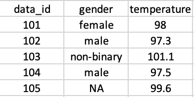

* Due date: Monday, September 21
* Submission process: Please submit your assignment directly to Gradescope. You can do this by knitting your file and downloading the PDF to your computer. Then navigate to Gradescope.com or via the link on BCourses to submit your assignment. 

Helpful hints:

- Knit your file early and often to minimize knitting errors! If you copy and paste code from the slides, you are bound to get an error that is hard to diagnose. Typing out the code is the way to smooth knitting. We recommend knitting your file each time after you write a few sentences/add a new code chunk, so you can detect the source of the knitting error more easily. This will save you and the teaching team time!

- Please make sure that your code does not run off the page of the knitted PDF. If it does, we can't see your work. To avoid this, have a look at your knitted PDF and ensure all the code fits in the file. When it doesn't, go back to your .Rmd file and add spaces (new lines) using the return or enter key so that the code runs onto the next line.

--------------------------------------------------------------------------------
```{r, include=FALSE}
# insert libraries that you will need
library(tidyverse)
library(lubridate)
```

\newpage 


### Question 1

Create a data frame and a tibble that matches the image below:

```{r}
# by the way, you can load images into rmarkdown! Cool, right?!
# here we use the knitr library (though there are multiple ways to load images)
library(knitr)

# notice that we specify the path to look within the current directory
# by using the period: .
# followed by a slash: / to pull the image file

```

Hint: You may need to load a library for tibbles.

```{r}
# your code here
```

What are the key differences between data frames and tibbles? 


Why are tibbles preferable?


\newpage

### Question 2

We just found out results for COVID testing and want to add it to our data. Using the tibble you just created, add the following test results to a new column called "results".

- 101 = NEGATIVE
- 102 = POSITIVE
- 103 = NEGATIVE
- 104 = NEGATIVE
- 105 = NEGATIVE

```{r}
# your code here
```

\newpage

### Question 3

You find out there was an error in data collection and subject 102's temperature is actually 98.3, not 97.3. Correct the value in your data frame.

```{r}
# your code here
```

\newpage

### Question 4

Load the "stds-by-disease-county-year-sex.csv" data set, which is in the data folder. 

You can find more information about this data set from the California Open Data Portal:

https://data.ca.gov/dataset/stds-in-california-by-disease-county-year-and-sex

```{r}
library(readr)

# your code here
```

You may have noticed that there are empty cells in the first three rows. Modify your code above (if you haven't already) to remove these rows.

\newpage

### Question 5
 
Let's explore this data set. Insert R chunks as needed. Find the following values:

```{r}
# your code here
```

How many rows?


How many columns? 


What are the column names?


What are the column types?


\newpage

### Question 6

You want to dig deeper into the data and focus on the years 2015 - 2018. Use the which() function to index which rows fit this year range and assign the results to a new data frame. To check whether this was done correctly you should expect the following dimensions: 2124 rows x 6 columns

```{r}
# your code here
```
\newpage

### Question 7

Your colleague is interested in this data set but hasn't setup their git repository. They ask you to help them out by exporting this new data set as a .csv file. Place your output in the /data folder.  

As a test, you can try to read in the .csv you created to make sure everything looks correct.

```{r}
# your code here
```
\newpage

### Challenge 

Look up how to use the unique() function and run it on the County column. You should see a total of 59 counties.

```{r}
# your code here
```
You decide to focus on one county. Subset your data for one of your choice.

```{r}
# your code here
```

You're very interested in finding the rate of cases per 100,000 population. Create a new column called "rate" with the calculated values. 

Rate = (Cases / Population) * 100,000

Hint: R allows you to use manipulate variables within a data frame to calculate new values so long as the rows and data types match up. For example: df$var3 <- df$var1 + df$var2

```{r}
# your code here
```


Before you start: [Please make a conscious effort to write clear and readable code](https://jef.works/R-style-guide/) through this problem set (and your future R career). Adding comments for unclear code is a very good practice!

For this problem set we will use *fictional* data inspired by research on non-deceptive or open-label placebos. Non-deceptive placebos are placebos but without the deception. Some studies have found suggestions that, despite not being tricked, participants are reporting similar benefits to what they would have with placebos! You can read more here:

[NPR: Is A Placebo A Sham If You Know It's A Fake And It Still Works?](https://www.npr.org/sections/health-shots/2016/10/27/499475288/is-it-still-a-placebo-when-it-works-and-you-know-its-a-placebo)

[Nature Communications: Placebos without deception reduce self-report and neural measures of emotional distress](https://www.nature.com/articles/s41467-020-17654-y)

In this fictional data we conducted an experiment across two university sites to investigate whether non-deceptive placebos decreased self-report pain ratings. There were three groups: control, placebo, and non-deceptive placebo. Each participant completed a pre- and post- pain induction task and provided a pain rating. All participants completed the same procedures during the pre-test. Only during the post-test did participants in the intervention arms (placebo, non-deceptive) receive additional instructions prior to the pain induction task (i.e., placebo or non-deceptive placebo ratings).

Data coding:

- ID: Contains participant ID number, a letter to indicate group, and pre or post tags. 

  C = Control
  P = Placebo
  N = Non-deceptive
  
- LOCATION: Research Site

- PAIN RATING: Self report of pain based on a 0-10 scale

- DATE: Date of observation

### Question 1

Read in the data! To make it slightly more challenging we have changed the format from a .csv to .xlsx and "hidden" the data one level deeper in the /data folder. Take a look at the data to get oriented. Please use "df" as the name of your data frame for this problem set.

```{r}

```

\newpage

### Question 2

It's a bit difficult to tell what group each participant is in with their IDs combined with their grouping. Create a new column called "GROUP" based on the letter assignment for IDs. Makes sure to following naming convention above.

```{r}

```

\newpage 

### Question 3

We have a similar issue telling apart the pre- and post- observations. Create a new column called "TEST" that distinguishes whether the observation is a pre- or post-test.

Unfortunately, the two research sites were not consistent in their naming convention. You will need to consider the different cases. 

```{r}

```

\newpage 

### Question 4

Again, there were difference in the formatting for dates across the two research sites. Create a new column called "DATE_FIX" that grabs only the date. Make sure this new date column takes the following format: yyyy-mm-dd

Hint: Check out ?parse_date_time

```{r}

```

\newpage 

### Question 5

You realize there was a strange error in your excel file that pushed the years forward by 1 year and behind by 7 days. Rather than editing your excel sheet and potentially making an incorrect permanent change to your raw data you decide to fix the error in R. Create a new column called "DATE_FIX_2" that fixes the date.

```{r}

```

\newpage 

### Question 6

Let's clean up our data frame by removing DATE and DATE_FIX. Afterwards, rename DATE_FIX2 to DATE.

```{r}

```

\newpage 

### Question 7

We're interested in plotting our data to begin digging into the results. Below is dplyr and ggplot code that we will go over later in the course. For the time being run the following code. You may need to install ggthemes.

```{r}
# install.packages("ggthemes")
# library(ggthemes)

df_plot <- df %>% 
  group_by(GROUP, LOCATION) %>%
  summarize(MEAN_PAIN = mean(PAIN_RATE))

ggplot(df_plot, aes(x = LOCATION, y = MEAN_PAIN, fill = GROUP)) +
  geom_col(position = "dodge") +
  ylim(0, 10) +
  theme_few() +
  scale_fill_few("Medium") +
  theme(axis.title = element_blank(),
        axis.title.y = element_text()) +
  labs(fill = "Group",
       title = "Non-deceptive placebo study",
       y = "Pain rating")
```

For a quick first pass we think this visualization isn't so bad. However, logically, we think that the order of the groups should be: Control, Placebo, Non-deceptive. Make GROUP into a factor that reflects this order. If done correctly when you re-run the above chunk the plot should have the same order.

```{r}

```

\newpage 

### Question 8

We're interested in seeing whether pain ratings changed from pre to post. 

Create two list of the pain ratings. One list holds all of the pre-test while the other list holds the post-test.

Once you have these list create a third list called "diff" that calculates the difference between post and pre. 

```{r}


# uncomment after you create diff
# this code will create a table of counts
#table(diff)
```

\newpage

### Challenge

Take a look at this [rmarkdown reference guide](https://rstudio.com/wp-content/uploads/2015/03/rmarkdown-reference.pdf).

On the first page are some very useful syntax to create *awesome* pdfs, htmls and, if we must, word documents. Practice a few of them below. The fun part (or frustrating part) is the repeated knitting to see if your intention worked out. 

Some suggestions: create bullet list, italics, bold, change the url colors, change font


You're done! Please knit to pdf and upload to gradescope. 